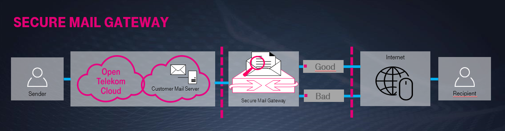

Introduction Secure Mail Gateway
================================

Description Mail-Gateway / Principle
------------------------------------

If you regularly send large amounts of e-mail from your e-mail server,
anti-spam databases can quickly put them on the list of unwanted senders - in
other words, they will be set to blacklisted ("blacklist"). In that case, the
IP address from which the allegedly unwanted emails are sent is classified as
untrust and emails sent from there are no longer delivered.

To avoid such unwanted consequences, the Open Telekom Cloud works with a Secure
Mail Gateway service. This service ensures the official and secure delivery of
outgoing e-mails and prevents their inclusion in that called blacklists, the
various blacklist providers. The original IP address of the sender is not
directly recognizable because the Secure Mail Gateway always carries out the
communication.

For security reasons, only this type of e-mail communication is activated in
the Open Telekom Cloud.

The Secure Mail Gateway is the interface for sending mail from the Open Telekom
Cloud to the Internet. The Secure Mail Gateway environment consists of three
mail servers, which are distributed over three locations for redundancy. The
locations are: *eu-de-01* / *eu-de-02* / *eu-de-03*

Scope of Service
----------------

Included Services:

-  Anti-Virus und Anti-Spam
-  Good Bad Gateway

.. tip::

   In order to ensure the reliability and performance of the Secure
   Mailgateways, the mailing per customer can be limited to 100
   Mails/min.
   In case the limit is activated and exceeded, the sender will receive
   the error message: „451 Ratelimit reached“.
   The limit is *not* active by default.

.. note::

   Due to the availability of the target systems, no guarantee can be
   given for delivery in time. ISPs may discard or lose email messages;
   recipients may have mistakenly given an incorrect address or ISPs may
   reject or tacitly reject the message if the recipient does not want to
   receive it.

Schematic
---------

